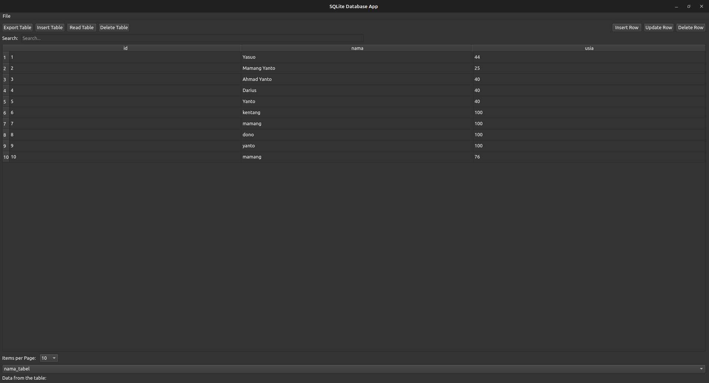

# App Database SQLite Minimal

Aplikasi ini adalah contoh sederhana penggunaan PyQt6 untuk berinteraksi dengan database SQLite. Aplikasi memungkinkan Anda untuk membuat, membuka, dan menyimpan database SQLite, serta melakukan operasi dasar seperti membaca, menulis, menghapus, dan mengupdate tabel dalam database.

## Fitur Utama
- **Buat Database:** Membuat database SQLite baru dengan tabel default atau pengguna.
- **Buka Database:** Memilih dan membuka database SQLite yang sudah ada.
- **Simpan Database:** Menyimpan database yang sudah dibuka.
- **Operasi Tabel:** Menampilkan, menambah, mengupdate, dan menghapus baris dalam tabel.
- **Pencarian:** Mencari data dalam tabel berdasarkan kriteria tertentu.
- **Ekspor SQL:** Mengekspor data tabel ke file SQL.

## Teknologi yang Digunakan
- **Python:** Bahasa pemrograman utama.
- **PyQt6:** Framework untuk membuat aplikasi GUI menggunakan Python.
- **SQLite:** Basis data berbasis file yang digunakan untuk penyimpanan data.

## Demo
